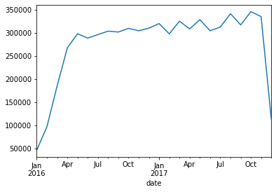
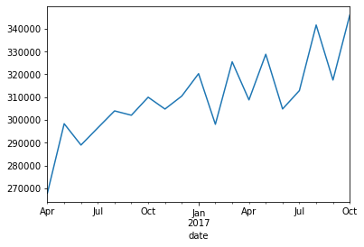
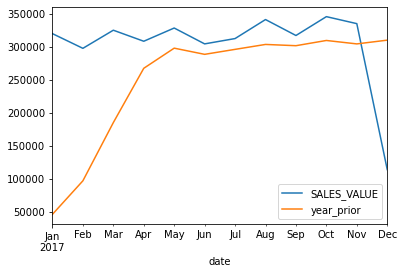
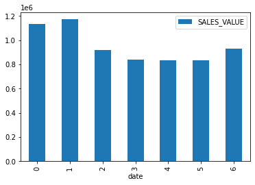
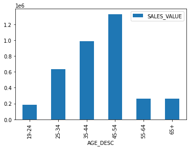
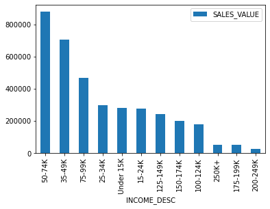
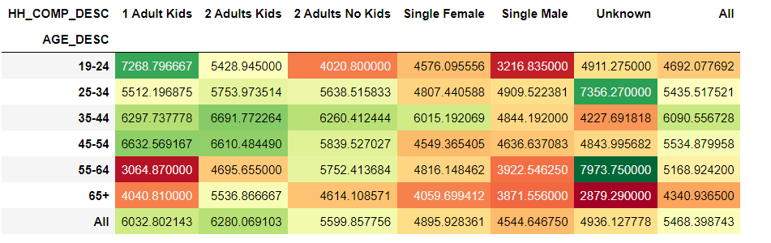

# PYTHON-POWERED RETAIL & GROCERY DATA ANALYSIS PROJECT
We will be utilizing the following three CSV files, with a preview of the initial five lines from each table provided below:
### Transactions Table Preview:

| household_key | BASKET_ID      | DAY | PRODUCT_ID | QUANTITY | SALES_VALUE |
| -------------- | -------------- | --- | ---------- | -------- | ----------- |
| 1364           | 26984896261    | 1   | 842930     | 1        | 2.19        |
| 1364           | 26984896261    | 1   | 897044     | 1        | 2.99        |
| 1364           | 26984896261    | 1   | 920955     | 1        | 3.09        |
| 1364           | 26984896261    | 1   | 937406     | 1        | 2.50        |
| 1364           | 26984896261    | 1   | 981760     | 1        | 0.60        |

... (Additional rows)

---

### Demographics Table Preview:

| AGE_DESC | INCOME_DESC | HH_COMP_DESC     | household_key |
| ---------| ----------- | ---------------- | -------------- |
| 65+      | 35-49K       | 2 Adults No Kids | 1              |
| 45-54    | 50-74K       | 2 Adults No Kids | 7              |
| 25-34    | 25-34K       | 2 Adults Kids    | 8              |
| 25-34    | 75-99K       | 2 Adults Kids    | 13             |
| 45-54    | 50-74K       | Single Female    | 16             |

... (Additional rows)

---

### Product Table Preview:

| PRODUCT_ID | DEPARTMENT  |
| -----------| ----------- |
| 25671      | GROCERY     |
| 26081      | MISC. TRANS. |
| 26093      | PASTRY      |
| 26190      | GROCERY     |
| 26355      | GROCERY     |

... (Additional rows)

### Task 0:
- Read transactions data.
- Select relevant columns: household_key, BASKET_ID, DAY, PRODUCT_ID, QUANTITY, and SALES_VALUE.
- Convert data types for DAY, QUANTITY, and PRODUCT_ID.
```
import pandas as pd
import numpy as np
```
```
import os

# Define the directory path
directory_path = r'C:\Users\..\project_data'

# Change the current working directory
os.chdir(directory_path)

# specify datatypes to convert
dtypes = {"DAY": "Int16", "QUANTITY": "Int32", "PRODUCT_ID": "Int32"}
```

transactions.info(memory_usage="deep")
```
<class 'pandas.core.frame.DataFrame'>
RangeIndex: 2146311 entries, 0 to 2146310
Data columns (total 6 columns):
 #   Column         Dtype  
---  ------         -----  
 0   household_key  int64  
 1   BASKET_ID      int64  
 2   DAY            Int16  
 3   PRODUCT_ID     Int32  
 4   QUANTITY       Int32  
 5   SALES_VALUE    float64
dtypes: Int16(1), Int32(2), float64(1), int64(2)
memory usage: 75.7 MB
```

### Task 1: Time-Based Analysis

1. Plot the sum of sales by month to analyze sales growth over time.
2. Plot the sum of sales after filtering down to dates between April 2016 and October 2017.
3. Plot the sum of sales for the year 2016 compared to the sales for the year 2017.
4. Plot total sales by day of the week.

```
# Set a date index, graby the sales column, and calculate a monthly sum using resampling.
# Then build the default line plot

(transactions.set_index("date")
 .loc[:, "SALES_VALUE"]
 .resample("M")
 .sum()
 .plot())
```



```
# Filter above plot to specified date range with row slice in .loc
(transactions
 .set_index("date")
 .loc["2016-04":"2017-10", "SALES_VALUE"]
 .resample("M")
 .sum()
 .plot())
```

```
# After resampling monthly sales, create a year_prior column with assign
# This column is our monthly sales shifted forward a year (12 rows/months)

(transactions
 .set_index("date")
 .loc[:, ["SALES_VALUE"]]
 .resample("M")
 .sum()
 .assign(year_prior = lambda x: x["SALES_VALUE"].shift(12))
 .loc["2017"]
 .plot()
)
```

```
# Group transactions by dayofweek, then calculate sum and plot a bar chart
(transactions
 .groupby(transactions["date"].dt.dayofweek)
 .agg({"SALES_VALUE": "sum"})
 .plot.bar()
)
```


## Task 2: Demographics Analysis Tasks

1. **Read Demographics Data:**
   - Read the `hh_demographic.csv` file, including only the columns AGE_DESC, INCOME_DESC, household_key, and HH_COMP_DESC.
   - Convert the appropriate columns to the category dtype.

2. **Calculate Household Sales:**
   - Group the transactions table by household_id.
   - Calculate the sum of SALES VALUE by household.

3. **Join Demographics and Transactions:**
   - Join the demographics DataFrame to the transactions table based on household_id.
   - Exclude rows from transactions that don't match.

4. **Plot Sales by Age and Income:**
   - Plot the sum of sales by age_desc and income_desc.

5. **Create Pivot Table:**
   - Create a pivot table of the mean household sales by AGE_DESC and HH_COMP_DESC.

```
# Specify columns to include 
dem_cols = ["AGE_DESC", "INCOME_DESC", "household_key", "HH_COMP_DESC"]

# Convert the object columns here to category dtype
dem_dtypes = {"AGE_DESC": "category", "INCOME_DESC": "category", "HH_COMP_DESC":"category"}

demographics = pd.read_csv('../project_data/hh_demographic.csv',
                          usecols=dem_cols,
                          dtype=dem_dtypes
                          )
```

demographics.info(memory_usage="deep")
```
<class 'pandas.core.frame.DataFrame'>
RangeIndex: 801 entries, 0 to 800
Data columns (total 4 columns):
 #   Column         Non-Null Count  Dtype   
---  ------         --------------  -----   
 0   AGE_DESC       801 non-null    category
 1   INCOME_DESC    801 non-null    category
 2   HH_COMP_DESC   801 non-null    category
 3   household_key  801 non-null    int64   
dtypes: category(3), int64(1)
memory usage: 10.9 KB
```
```
#Create total sales by household dataframe

household_sales = (transactions
                   .groupby("household_key")
                   .agg({"SALES_VALUE": "sum"})
                  )

household_sales
```
| household_key | SALES_VALUE |
|---------------|-------------|
| 1             | 4330.16     |
| 2             | 1954.34     |
| 3             | 2653.21     |
| 4             | 1200.11     |
| 5             | 779.06      |
| ...           | ...         |
| 2095          | 3790.49     |
| 2096          | 1301.65     |
| 2097          | 8823.83     |
| 2098          | 682.46      |
| 2099          | 691.30      |


```
# Join household sales and demographics table on household_key (inner since we're interested in both sets)

household_sales_demo = (household_sales.merge(demographics, 
                             how="inner",
                             left_on='household_key',
                             right_on="household_key",
                             )
                       )
```
household_sales_demo.info(memory_usage="deep")
```
<class 'pandas.core.frame.DataFrame'>
Int64Index: 668 entries, 0 to 667
Data columns (total 5 columns):
 #   Column         Non-Null Count  Dtype   
---  ------         --------------  -----   
 0   household_key  668 non-null    int64   
 1   SALES_VALUE    668 non-null    float64 
 2   AGE_DESC       668 non-null    category
 3   INCOME_DESC    668 non-null    category
 4   HH_COMP_DESC   668 non-null    category
dtypes: category(3), float64(1), int64(1)
memory usage: 19.8 KB
```
```
# Calculate sum of sales by age group

(household_sales_demo
.groupby(["AGE_DESC"])
.agg({"SALES_VALUE": "sum"})
.plot.bar()
)
```


```
#Calculate sum of sales by income, ordered by magnitude

(household_sales_demo
 .groupby(["INCOME_DESC"])
 .agg({"SALES_VALUE": "sum"})
 .sort_values("SALES_VALUE", ascending=False)
 .plot.bar())
```


```
#Calculate mean household spend by Age Description and HH Composition
#Format with a heatmap across all cells

(household_sales_demo.pivot_table(index="AGE_DESC", 
                 columns="HH_COMP_DESC",
                 values="SALES_VALUE",
                 aggfunc="mean",
                 margins=True)
 .style.background_gradient(cmap="RdYlGn", axis=None)
)
```



### Task 3: Product Demographics Analysis Tasks

1. **Read Product Data:**
   - Read the product csv file.
   - Include only product_id and department from product (consider converting columns).

2. **Join Product, Transactions, and Demographics:**
   - Join the product DataFrame to transactions and demographics tables.
   - Perform an inner join when joining both tables.

3. **Pivot and Analyze:**
   - Pivot the fully joined dataframe by AGE_DESC and DEPARTMENT.
   - Calculate the sum of sales.
   - Identify which category performs well for the youngest demographic.

```
#specify columns to use
product_cols = ["PRODUCT_ID", "DEPARTMENT"]

#specify datatypes for each column
product_dtypes = {"PRODUCT_ID": "Int32", "DEPARTMENT": "category"}

product = pd.read_csv('../project_data/product.csv',
                     usecols=product_cols,
                     dtype=product_dtypes
                     )
```
```
product.dtypes
```
PRODUCT_ID       Int32
DEPARTMENT    category
dtype: object

```
#Join all three tables together with an inner join
#Join product on product_id (only shared column)
trans_demo_dept = (transactions
                  .merge(demographics, 
                         how="inner",
                         left_on='household_key',
                         right_on="household_key",)
                  .merge(product,
                         how="inner",
                         left_on="PRODUCT_ID",
                         right_on="PRODUCT_ID")
             
             )
```
```
#much smaller than our original, uncoverted transactions df!
trans_demo_dept.info(memory_usage="deep")
```
```
<class 'pandas.core.frame.DataFrame'>
RangeIndex: 1161575 entries, 0 to 1161574
Data columns (total 10 columns):
    Column         Non-Null Count    Dtype   
---  ------         --------------    -----   
 0   household_key  1161575 non-null  int64   
 1   BASKET_ID      1161575 non-null  int64   
 2   DAY            1161575 non-null  Int16   
 3   PRODUCT_ID     1161575 non-null  Int32   
 4   QUANTITY       1161575 non-null  Int32   
 5   SALES_VALUE    1161575 non-null  float64 
 6   AGE_DESC       1161575 non-null  category
 7   INCOME_DESC    1161575 non-null  category
 8   HH_COMP_DESC   1161575 non-null  category
 9   DEPARTMENT     1161575 non-null  category
dtypes: Int16(1), Int32(2), category(4), float64(1), int64(2)
memory usage: 45.4 MB
```
```
#Where does our youngest demographic rank near the top in sales?

(trans_demo_dept.pivot_table(index="DEPARTMENT",
                            columns="AGE_DESC",
                            values="SALES_VALUE",
                            aggfunc="sum")
 .style.background_gradient(cmap="RdYlGn", axis=1))
```
## Sales by Age and Department

| DEPARTMENT       | 19-24    | 25-34    | 35-44    | 45-54    | 55-64    | 65+      |
| ---------------- | -------- | -------- | -------- | -------- | -------- | -------- |
| AUTOMOTIVE       | 11.64    | 21.25    | 72.58    | 55.92    | 0.0      | 16.37    |
| CHARITABLE CONT  | 0.0      | 0.0      | 0.0      | 0.0      | 0.0      | 0.0      |
| CHEF SHOPPE      | 81.3     | 134.16   | 348.53   | 418.24   | 80.86    | 149.24   |
| CNTRL/STORE SUP  | 2.0      | 0.0      | 1.0      | 9.95     | 2.0      | 0.1      |
| COSMETICS        | 698.63   | 2273.03  | 4362.02  | 5187.57  | 986.26   | 600.9    |
| ...              | ...      | ...      | ...      | ...      | ...      | ...      |
| TRAVEL & LEISUR  | 50.22    | 173.56   | 283.19   | 431.48   | 81.15    | 133.2    |
| VIDEO            | 0.0      | 7.99     | 13.99    | 0.0      | 0.0      | 0.0      |
| VIDEO RENTAL     | 0.0      | 0.0      | 0.0      | 0.0      | 0.0      | 0.0      |

### EXPORT

Finally, export your pivot table to an excel file. Make sure to provide a sheet name.
```
#Call to_excel on pivot table above - note the formatting gets passed to excel too!

(trans_demo_dept.pivot_table(index="DEPARTMENT",
                            columns="AGE_DESC",
                            values="SALES_VALUE",
                            aggfunc="sum")
 .style.background_gradient(cmap="RdYlGn", axis=1)
 .to_excel("demographic_category_sales.xlsx", sheet_name="sales_pivot")
)
```
```
product.head()
```
## Product Categories

| PRODUCT_ID | DEPARTMENT    |
| ---------- | ------------- |
| 25671      | GROCERY        |
| 26081      | MISC. TRANS.   |
| 26093      | PASTRY         |
| 26190      | GROCERY        |
| 26355      | GROCERY        |
